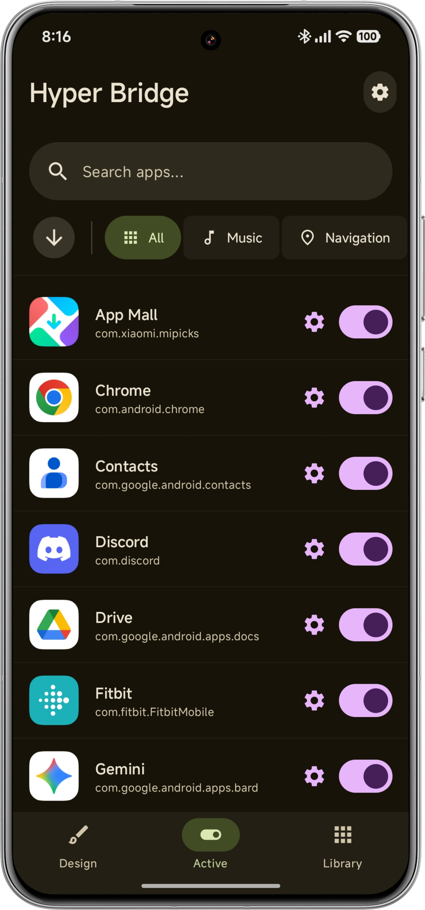
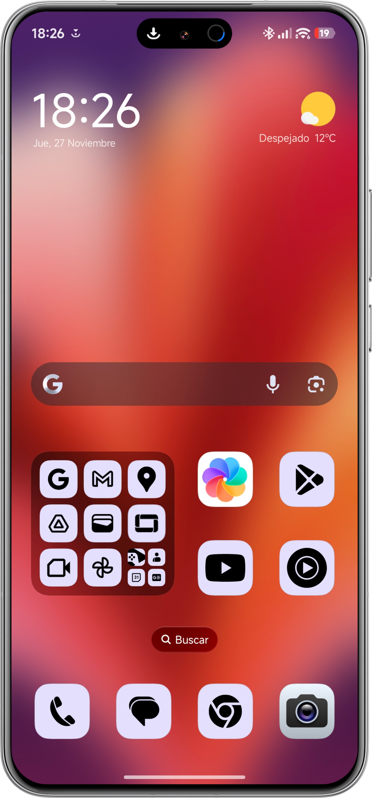
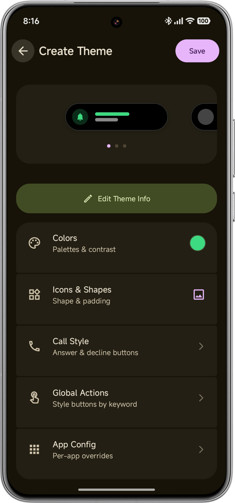
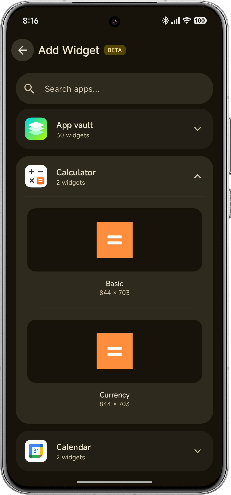

<p align="center">
  
</p>

<h1 align="center">HyperBridge — Sykeptical Edition</h1>

<p align="center">
  <strong>A reliability-focused, independently maintained HyperBridge fork for HyperOS.</strong>
</p>

<p align="center">
  HyperBridge converts standard Android notifications into the pill-shaped HyperIsland UI around the camera cutout, with theme customization, widgets, messaging, calls, media, navigation, downloads, and more.
</p>

<p align="center">
  <a href="https://github.com/SykepticalS/Sykepticals_HyperBridge/releases"></a>
</p>

<p align="center">
  
  
  
  
  <a href="https://crowdin.com/project/hyper-bridge"></a>
</p>

<br>

## About this fork

This repository contains the **Sykeptical Edition** of HyperBridge. It is an improved fork created after issues were reported to the original developer but were not being fixed quickly enough, so I implemented the fixes myself.

The project remains built on the original developer's work. This fork is independently maintained and is not presented as the official upstream release. If HyperBridge is useful to you, please consider [supporting the original developer](https://github.com/sponsors/D4vidDf) as well.

### Current identity

| | Sykeptical Edition |
|---|---|
| Version | `0.5.9-sykeptical` |
| Android package | `com.sykeptical.hyperbridge` |
| Theme intent | `com.sykeptical.hyperbridge.APPLY_THEME` |
| Maintainer | [Sykeptical](https://github.com/SykepticalS) |

Because the package name differs from upstream HyperBridge, Android treats this edition as a separate app. It can coexist with the original, but the original app's settings and data are not automatically shared with this edition.

## What the Sykeptical Edition changes

The current fork includes the following work on top of upstream `v0.5.6`:

* **No duplicate re-expansion:** Same-event notification reposts now retain their logical message identity across refreshed post times, source-key replacements, and rendering-only changes, preventing an already-collapsed Island from floating again.
* **Accurate auto-hide durations:** Standard and message islands now honor the effective global or per-app duration instead of being removed after a hard-coded minute; disabling auto-hide leaves them untimed.
* **Reliable notification lifecycle:** Reworked notification intake, reconciliation, expiry, and recovery to reduce missing, duplicated, stale, or reappearing islands.
* **Messaging deduplication:** Added content-aware message fingerprinting and grouping for rapid WhatsApp and other chat updates.
* **Latest-update-wins processing:** Serializes rapid source changes and prevents older work from overwriting newer notification state.
* **Improved call handling:** Added call classification and session tracking for more reliable incoming, active, answered, declined, and ended call transitions.
* **Better visual resolution:** Improved icon sourcing, bitmap bounds, and rendered-data normalization for more consistent island artwork.
* **Setup and diagnostics:** Added setup-health diagnostics, safer onboarding migration, and a guided floating-notification settings flow.
* **Duplicate-banner guidance:** Recommends disabling an app's **Floating notifications** setting when HyperBridge is providing its banner.
* **Fork transparency:** Added a first-run acknowledgement explaining this edition and linking users to support the original developer.
* **Regression coverage:** Added focused unit tests and a [release manual-test matrix](docs/release-manual-test-matrix.md) for notification, message, call, reconciliation, visual, and setup behavior.

## Optimization work

The Sykeptical Edition optimizes the full notification path, not just the visible Island. The goal is to do less duplicate work, keep temporary state bounded, and make rapid notification changes deterministic.

### Notification processing

* **Candidate-first intake:** Sparse Android callbacks are refreshed from the active-notification snapshot before expensive classification and rendering begin. Empty or unusable candidates are rejected early.
* **Latest-generation wins:** Per-source generation gates prevent delayed coroutine work from overwriting a newer notification. Lifecycle mutations are serialized only where shared Island state must remain consistent.
* **Update instead of recreate:** Logical notification identities, content hashes, and message fingerprints allow genuine updates to reuse the current Island while suppressing framework reposts and duplicate chat events.
* **Targeted reconciliation:** Service reconnects compare Android's active sources with HyperBridge's tracked Islands and repair only missing or stale entries instead of rebuilding everything.
* **Bounded recovery:** Expiry tombstones, replacement windows, removal delays, and refresh attempts all have explicit limits, preventing endless retries or stale-notification resurrection.

### Memory and CPU use

* **Shared settings cache:** Lightweight `AppPreferences` instances share one Room observer and one in-memory settings cache, avoiding duplicate database collectors and blocking reads in the notification hot path.
* **Bounded visual caches:** App labels, application icons, extracted brand colors, and processed action bitmaps use size-limited LRU caches rather than growing for the lifetime of the service.
* **Aggressive lifecycle cleanup:** Finished jobs, source aliases, expired records, message fingerprints, call sessions, pictures, and reverse-translation entries are cancelled or pruned when they are no longer useful.
* **Work on the correct dispatcher:** Package scanning, backup processing, notification refreshes, and other I/O-heavy operations run away from the main thread; UI state remains coroutine- and Flow-driven.

### Rendering and background behavior

* **Reusable rendered assets:** Stable resource keys and normalized bitmap bounds reduce repeated icon work while keeping artwork correctly scaled and visible.
* **State-aware timers and calls:** Call timers are created only after a verified connection transition, and hidden call stages continue lightweight session tracking without posting an Island.
* **Permanent Island reconciliation:** The permanent Island reacts to active Island and widget state, avoiding overlaps and unnecessary reposts when nothing meaningful changed.
* **HyperOS survival guidance:** Setup Health exposes notification access, Autostart, and battery-restriction checks so users can fix OS-level service termination without root or continuous polling.

These changes are designed to reduce redundant allocations, database access, rendering, and notification churn. Exact CPU and battery results still depend on the device, HyperOS version, enabled apps, widgets, and notification volume.

## 🚀 Features

* **Native Visuals:** Transforms notifications into HyperOS system-style islands.
* **🎨 Theme Engine:** Customize every pixel.
    * **Theme Creator:** Built-in editor to design your own themes with real-time previews.
    * **Smart Colors:** Automatically extract vibrant brand colors from app icons.
    * **Icon Shaping:** Choose between shapes like *Squircle*, *Clover*, *Arch*, and *Cookie*.
    * **Granular Control:** Per-app overrides for colors, icons, and action styles.
    * **Smart Icon Tinting:** Intelligently tints dark/monochrome icons to remain visible.
* **🧩 Widgets:** Pin standard Android widgets to the island layer for quick access—even on the Lockscreen!
* **🧠 Intelligent Permanent Island:** The permanent island now automatically hides itself whenever an active widget is shown on the screen, preventing awkward overlaps.
* **Smart Integration:**
    * **🎵 Media:** Show album art and "Now Playing" status with visualizer support.
    * **🧭 Navigation:** Real-time turn-by-turn instructions (Google Maps, Waze).
    * **⬇️ Downloads:** Dedicated circular progress layout with a satisfying "Green Tick" animation upon completion.
    * **📞 Calls:** Dedicated layout for incoming and active calls with timers.
* **🛡️ Spoiler Protection:** Define blocked terms globally or per-app to prevent specific notifications (e.g., message spoilers) from popping up on the Island.
* **Sui & Shizuku Support:** Fully supports Sui and Shizuku for enhanced network operations and seamless integration on rooted devices.
* **Total Control:** Choose exactly which apps trigger the island, customize timeouts, and toggle floating behavior per app.

## 👩‍💻 For Developers: Create Themes

HyperBridge supports an open theming standard (`.hbr` packages). You can create themes and distribute them, or integrate an "Apply Theme" button directly into your own app (Launcher, Icon Pack, etc.).

* **Documentation:** [Full Guide on Creating & Distributing Themes](https://github.com/SykepticalS/Sykepticals_HyperBridge/discussions/78)
* **Intent API:** Send themes programmatically using `com.sykeptical.hyperbridge.APPLY_THEME`.

## 🌐 Supported Languages

HyperBridge is fully localized thanks to our amazing community. **Want to add your language?** We now use Crowdin for easy translation management.

👉 **[Help translate HyperBridge on Crowdin](https://crowdin.com/project/hyper-bridge)**

* 🇺🇸 **English** (Default)
* 🇪🇸 **Spanish** (Español)
* 🇧🇷 **Portuguese** (Português Brasileiro) — Thanks to [@NIICKTCHUNS](https://github.com/NIICKTCHUNS)
* 🇵🇱 **Polish** (Polski) — Thanks to [@kacskrz](https://github.com/kacskrz)
* 🇸🇰 **Slovak** (Slovenčina)
* 🇰🇷 **Korean** (한국어) — Thanks to [@alexkoala](https://github.com/alexkoala)
* 🇺🇦 **Ukrainian** (Українська) — Thanks to [@ItzDFPlayer](https://github.com/ItzDFPlayer)
* 🇷🇺 **Russian** (Русский) — Thanks to [@kilo3528](https://github.com/kilo3528)
* 🇩🇪 **German** (Deutsch) — Thanks to [@kilo3528](https://github.com/kilo3528)
* 🇮🇩 **Indonesian** (Bahasa Indonesia)
* 🇹🇷 **Turkish** (Türkçe)

## 🛠️ Tech Stack

* **Language:** Kotlin
* **UI:** Jetpack Compose (Material 3 Expressive)
* **Architecture:** MVVM
* **Storage:** Room Database (SQLite)
* **Services:** NotificationListenerService, WidgetOverlayService
* **Concurrency:** Kotlin Coroutines & Flow

## 📸 Screenshots

| Home Screen | Active Island | Theme Creator | Widget Picker |
|:---:|:---:|:---:|:---:|
|  |  |  |  |

## 📥 Installation

The Sykeptical Edition is not currently distributed through Google Play. Only install APKs published by this repository.

Requirements: Android 15 or newer (`minSdk 35`) on a compatible Xiaomi, POCO, or Redmi device running HyperOS/MIUI.

### Option 1: Release APK (Recommended)

1. Download the latest `0.5.9-sykeptical` or newer APK from [GitHub Releases](https://github.com/SykepticalS/Sykepticals_HyperBridge/releases).
2. Install it on your Xiaomi, POCO, or Redmi device.

### Option 2: Build from source

Clone the repository and build the debug APK with:

```shell
./gradlew assembleDebug
```

The output is written to `app/build/outputs/apk/debug/app-debug.apk`.

### ⚙️ Setup

1. Complete the in-app onboarding and grant **Notification Access** and the other requested Android permissions.
2. Enable **Autostart** and set battery use to **No Restrictions** so HyperOS does not stop the background service.
3. For apps handled by HyperBridge, disable their **Floating notifications** setting if you see duplicate banners.

Root, Sui, Shizuku, and ADB are not required for the standard setup. Shizuku remains available only for optional device-specific functionality.

## 🤝 Contributing

Contributions are welcome! Please read our [Contributing Guidelines](CONTRIBUTING.md) before submitting a Pull Request.

1.  **Fork** the repository.
2.  Create a new branch (`git checkout -b feature/AmazingFeature`).
3.  Commit your changes (`git commit -m 'Add some AmazingFeature'`).
4.  Push to the branch (`git push origin feature/AmazingFeature`).
5.  Open a **Pull Request**.

## 💖 Credit and support

This edition is maintained by [Sykeptical](https://github.com/SykepticalS), but HyperBridge began with the original developer's open-source work. If the project has improved your daily experience, please consider supporting that work too.

<a href="https://github.com/sponsors/D4vidDf">
  
</a>

## 📜 License

Distributed under the Apache 2.0 License. See `LICENSE` for more information.

## 👤 Maintainer

**Sykeptical**
* GitHub: [@SykepticalS](https://github.com/SykepticalS)
* Repository: [SykepticalS/Sykepticals_HyperBridge](https://github.com/SykepticalS/Sykepticals_HyperBridge)
* Original developer support: [GitHub Sponsors](https://github.com/sponsors/D4vidDf)
