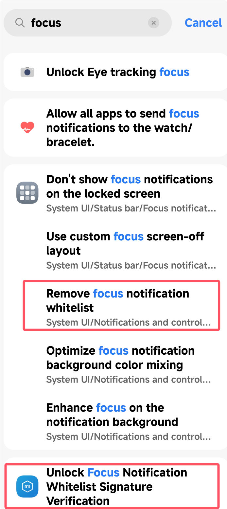

# Quick Start

::: warning Prerequisites
- Device must have **Root** access
- **LSPosed** framework installed with **API version >= 101**
- System running **HyperOS 3/4**
- **HyperCeiler** installed
:::

::: tip Resources & Discussion
- Telegram: <https://t.me/HyperIsland_Module>
:::

## Step 1: Install the Module

1. Go to [Resource Downloads](/en/downloads#module-download) for the latest APK
2. Install the APK on your device

## Step 2: Activate the Module in LSPosed

1. Open **LSPosed** Manager, go to the "Modules" list
2. Find **HyperIsland** and enable it
3. In the module scope, check the recommended apps:
   - **Download Manager Extension**: check "Download Manager"
   - **Super Island**: check "System UI"
   - **Focus Notification Crack**: check "Xiaomi Services Framework"
4. Save and tap the **restart button** in the top-right corner (or restart your phone)

## Step 3: Enable Focus Notification Bypass in HyperCeiler

> 💡 Super Island style notifications require HyperCeiler's "Focus Notification" bypass to display correctly. If your HyperCeiler version is too old, you may not find the corresponding options — please update to the latest version.

1. Open **HyperCeiler**, go to "System UI" or "Xiaomi Services Framework" settings
2. Find **"Remove Focus Notification Whitelist"** and **"Unlock Focus Notification Whitelist Verification"**
   {style="width: 50%;"}
3. Enable and restart the scope

::: danger Built-in Bypass
The app includes a built-in whitelist bypass, but it doesn't support safe mode and may cause System UI to crash infinitely. Make sure you can recover your device before enabling.
:::

## Step 4: Configure the Module

### App Adaptation
Open the **HyperIsland** app and enable the switches for the apps you need. It's not recommended to enable all.

::: tip Download Island Note
Download Island is disabled by default. Go to the app and enable **"Show System Apps"**, then check **"Download Manager"**.
:::

- **Notification Super Island**: Convert any notification to Focus Notification + Super Island display
- **Download**: Auto-detect download status and convert to Focus Notification + Super Island
- **AI Notification Super Island**: AI simplifies left and right sides of the Super Island

### AI Summary Configuration

- AI Summary only supports **non-thinking** models. Please do not use thinking models.

- The URL must be fully filled in. **Do not omit /chat/completions**.
- If the summary fails, it will automatically fall back to a regular notification. If it does not work, please check your configuration.
- If the error persists, please check whether your **account balance** is sufficient.

::: details DeepSeek Configuration
- Model: **deepseek-v4-flash**
- API: **https://api.deepseek.com/v1/chat/completions**
- Thinking disable field: **thinking**
- Thinking disable value: **{"type":"disabled"}**
:::

::: details Alibaba Cloud Bailian Configuration
- Model: **qwen-flash**
- API: **https://dashscope.aliyuncs.com/compatible-mode/v1/chat/completions**
- Thinking disable field: **enable_thinking**
- Thinking disable value: **false**
:::

## FAQ

For installation, display, and configuration questions, see the standalone page.

[View FAQ](/en/faq){.VPButton .medium .brand}
