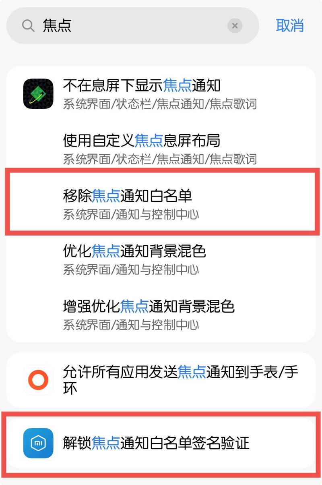

# 快速上手

:::: warning 前置要求
- 设备已获取 **Root** 权限
- 已安装 **LSPosed** 框架并且 **API版本>=101**
- 系统为 **澎湃 OS3/4**
- 已安装 **HyperCeiler**
::::

::: tip 资源获取&讨论解答
- Telegram：<https://t.me/HyperIsland_Module>
:::

## 第一步：安装模块

1. 前往 [资源下载](/downloads#module-download) 下载最新版本的 APK
2. 安装 APK 到你的设备

## 第二步：在 LSPosed 中激活模块

1. 打开 **LSPosed** 管理器，进入「模块」列表
2. 找到 **HyperIsland** 并启用开关
3. 在模块的作用域中，勾选推荐的应用：
   - **下载管理器拓展**：勾选「下载管理器」
   - **超级岛**：勾选「系统界面」
   - **焦点通知破解**：「小米服务框架」
4. 确认保存后，点击**软件右上角重启按钮**，重启对应作用域内的应用（或直接重启手机）使 Hook 生效

## 第三步：在 HyperCeiler 中开启「移除焦点通知白名单」和「解锁焦点通知白名单验证」

> 💡 超级岛样式的通知需要经过 HyperCeiler 的「焦点通知」破解才能正常显示。如果你的 HyperCeiler 版本过旧可能找不到相应入口，请自行更新版本。

1. 打开 **HyperCeiler**，进入「系统界面」或「小米服务框架」相关设置
2. 分别找到 **「移除焦点通知白名单」** 和 **「解锁焦点通知白名单验证」**
  {style="width: 50%;"}
3. 打开开关并重启作用域

::: danger 内置破解
软件内置破解白名单，但不支持安全模式，可能导致系统界面无限崩溃，请确保有能力救砖再启用
:::

## 第四步：配置模块

### 应用适配
打开 **HyperIsland** 应用，根据需要启用相应应用的开关，不建议全选开启。

::: tip 下载上岛说明
下载上岛默认关闭，需要自行去应用中开启 **「显示系统应用」**并勾选 **「下载管理程序」**
:::

- **通知超级岛**：支持任意通知转为焦点通知 + 超级岛显示
- **下载**：自动识别下载状态并转为焦点通知 + 超级岛
- **AI 通知超级岛**：超级岛左右交给 AI 精简

### AI 总结配置

- AI总结仅支持**非思考**模型，请勿使用思考模型
- URL需完整填写， **不可遗漏/chat/completions**
- 总结失败会自动回退为普通通知，如不生效请检查是否正确配置
- 如果仍报错请检查**账户余额**是否充足

::: details DeepSeek 配置
- 模型: **deepseek-v4-flash**
- API: **https://api.deepseek.com/v1/chat/completions**
- 关闭思考字段: **thinking**
- 关闭思考值: **{"type":"disabled"}**
:::

::: details 阿里云百炼 配置
- 模型: **qwen-flash**
- API: **https://dashscope.aliyuncs.com/compatible-mode/v1/chat/completions**
- 关闭思考字段: **enable_thinking**
- 关闭思考值: **false**
:::

## 常见问题

更多安装、显示和配置问题请查看独立页面。

[查看常见问题](/faq){.VPButton .medium .brand}
